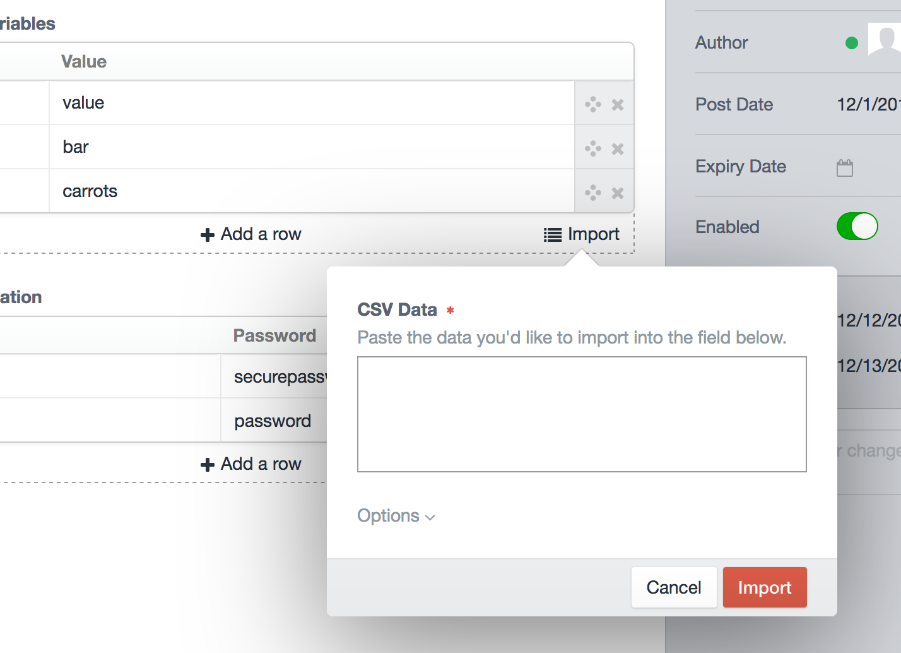

# Importable plugin for Craft CMS 3.x

Add CSV data import functionality to the native Table fieldtype.

## Requirements

This plugin requires Craft CMS 3.0.0-RC1 or later.

## Installation

To install the plugin, follow these instructions.

1. Open your terminal and go to your Craft project:

        cd /path/to/project

2. Then tell Composer to load the plugin:

        composer require markdrzy/importable

3. In the Control Panel, go to Settings → Plugins and click the “Install” button for Importable.

## Using Importable

Create fields using the native Table fieldtype. Import CSV (or other delimited data) into your table by clicking the "Import" button.

## Importable Roadmap

* Support non-text cells.

Brought to you by [Mark Drzycimski](https://clickrain.com/about/mark-drzycimski)
